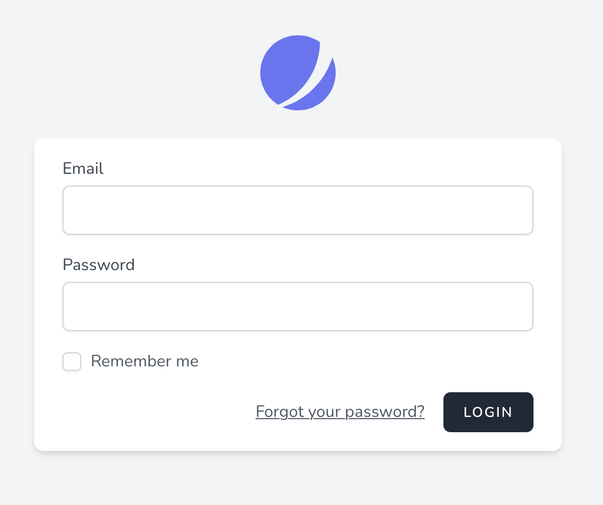

# Аутентификация

[[toc]]

## Вступление

Laravel Jetstream автоматически формирует логин, двухфакторный вход, регистрацию, сброс пароля и проверку электронной почты для Вашего проекта, позволяя Вам начать создавать функции, которые Вам нужны, вместо того, чтобы беспокоиться о мельчайших деталях аутентификации пользователя.



## Laravel Fortify

Под капотом аутентификационные части Jetstream работают на [Laravel Fortify](https://github.com/laravel/fortify), который является независимой от внешнего интерфейса серверной частью аутентификации для Laravel. По сути, Fortify определяет маршруты и контроллеры для реализации функций аутентификации приложения, в то время как пользовательский интерфейс Jetstream выполняет запросы к этим маршрутам.

При установке Jetstream в Ваше приложение устанавливается файл конфигурации `config/fortify.php`. В этом файле конфигурации Вы можете настроить различные аспекты поведения Fortify, такие как средство защиты аутентификации, которое следует использовать, куда следует перенаправлять пользователей после аутентификации и многое другое.

В файле конфигурации `fortify` Вы также можете отключить все функции Fortify, такие как возможность обновления информации профиля или паролей.

## Представления / Страницы

При использовании стека Livewire окно входа в систему отображается с использованием шаблона Blade `resources/views/auth/login.blade.php`. При использовании стека Inertia это представление отображается с использованием шаблона `resources/js/Pages/Auth/Login.vue`. Каталоги, содержащие эти представления, также содержат другие представления / страницы, связанные с аутентификацией для Вашего приложения.

### Настройка представлений аутентификации

Laravel Jetstream автоматически отобразит правильные представления для входа в Ваше приложение и других экранов аутентификации. Однако иногда может потребоваться настроить способ визуализации определенного представления аутентификации или данных, получаемых представлением.

Вся логика визуализации представления аутентификации может быть настроена с использованием соответствующих методов, доступных через класс `Laravel\Fortify\Fortify`. Как правило, этот метод следует вызывать из метода `boot` класса `App\Providers\JetstreamServiceProvider`:

```php
use Laravel\Fortify\Fortify;

/**
 * Загрузка любых сервисов приложений.
 *
 * @return void
 */
public function boot()
{
    Fortify::loginView(function () {
        return view('auth.login');
    });
}
```

#### Настройка представлений инерционной аутентификации

Если Ваше приложение использует стек Inertia, Вы можете вернуть страницы Inertia из Ваших замыканий настройки представления:

```php
use Illuminate\Support\Facades\Route;
use Inertia\Inertia;
use Laravel\Fortify\Fortify;

Fortify::loginView(function () {
    return Inertia::render('Auth/Login', [
        'canResetPassword' => Route::has('password.request'),
        'status' => session('status'),
    ]);
});
```

## Настройка процесса аутентификации

### Настройка аутентификации пользователя

Иногда Вам может потребоваться полная настройка того, как аутентифицируются учетные данные пользователя и как пользователи извлекаются из базы данных Вашего приложения. К счастью, Jetstream позволяет легко сделать это с помощью метода `Fortify::authenticateUsing`.

Метод `authenticateUsing` принимает замыкание, которое получает входящий HTTP-запрос. Замыкание отвечает за проверку учетных данных для входа, прикрепленных к запросу, и за возврат связанного экземпляра пользователя. Если учетные данные недействительны или пользователь не может быть найден, замыкание должно вернуть `null` или `false`. Обычно этот метод следует вызывать из метода `boot` Вашего `JetstreamServiceProvider`:

```php
use App\Models\User;
use Illuminate\Http\Request;
use Illuminate\Support\Facades\Hash;
use Laravel\Fortify\Fortify;

/**
 * Загрузка любых сервисов приложений.
 *
 * @return void
 */
public function boot()
{
    // ...

    Fortify::authenticateUsing(function (Request $request) {
        $user = User::where('email', $request->email)->first();

        if ($user &&
            Hash::check($request->password, $user->password)) {
            return $user;
        }
    });
}
```

Если Вы предпочитаете инкапсулировать свой собственный процесс аутентификации в классе, а не в замыкании, Вы можете передать "вызываемый" массив PHP методу `authenticateUsing`:

```php
use App\Actions\AuthenticateLoginAttempt;
use Laravel\Fortify\Fortify;

Fortify::authenticateUsing([new AuthenticateLoginAttempt, '__invoke']);
```

### Настройка конвейера аутентификации

Laravel Fortify, которая является базовой библиотекой аутентификации Jetstream, аутентифицирует запросы на вход через конвейер вызываемых классов.

При желании Вы можете определить настраиваемый конвейер классов, через которые должны передаваться запросы на вход. Каждый класс должен иметь метод `__invoke`, который получает входящий экземпляр `Illuminate\Http\Request` и, как мидлвар, переменную `$next`, которая вызывается для передачи запроса следующему классу в конвейере.

Чтобы определить свой собственный конвейер, Вы можете использовать метод `Fortify::authenticateThrough`. Этот метод принимает замыкание, которое должно возвращать массив классов для передачи запроса входа в систему. Обычно этот метод следует вызывать из метода `boot` Вашего класса `App\Providers\JetstreamServiceProvider`.

В приведенном ниже примере содержится определение конвейера по умолчанию, которое Вы можете использовать в качестве отправной точки при внесении собственных изменений:

```php
use Laravel\Fortify\Actions\AttemptToAuthenticate;
use Laravel\Fortify\Actions\EnsureLoginIsNotThrottled;
use Laravel\Fortify\Actions\PrepareAuthenticatedSession;
use Laravel\Fortify\Actions\RedirectIfTwoFactorAuthenticatable;
use Laravel\Fortify\Fortify;
use Illuminate\Http\Request;

Fortify::authenticateThrough(function (Request $request) {
    return array_filter([
            config('fortify.limiters.login') ? null : EnsureLoginIsNotThrottled::class,
            RedirectIfTwoFactorAuthenticatable::class,
            AttemptToAuthenticate::class,
            PrepareAuthenticatedSession::class,
    ]);
});
```

## Восстановление пароля

В дополнение к шаблонам представлений и действий, связанных с входом в систему / аутентификацией, Jetstream также формирует ресурсы, необходимые пользователю для сброса своего пароля в случае его забывания. Конечно, эта функция использует базовые [функции сброса пароля](https://getlaravel.ru/docs/passwords).

:::tip Laravel Mail

Перед использованием функции сброса пароля Вы должны убедиться, что Ваше приложение Laravel настроено на [отправку электронных писем](https://getlaravel.ru/docs/mail). В противном случае Laravel не сможет отправлять ссылки для сброса пароля пользователям Вашего приложения.
:::

### Экшены

Как типично для большинства функций Jetstream, логику, выполняемую для удовлетворения запросов на сброс пароля, можно найти в классе действий в Вашем приложении. Помните, что действия - это гранулярные классы, которые отвечают за выполнение одной задачи, связанной с функцией Jetstream или Fortify.

В частности, класс `App\Actions\Fortify\ResetUserPassword` будет вызываться, когда пользователь сбрасывает свой пароль. Это действие отвечает за проверку нового пароля пользователя и обновление пароля в экземпляре пользователя. Следовательно, любые настройки, которые Вы хотите внести в логику сброса пароля пользователя, должны выполняться в этом классе. Действие получает массив `$input`, который содержит все входные данные входящего запроса.

#### Правила проверки пароля

Действия `App\Actions\Fortify\CreateNewUser`, `App\Actions\Fortify\ResetUserPassword` и `App\Actions\Fortify\UpdateUserPassword` используют трейт `App\Actions\Fortify\PasswordValidationRules`.

Как Вы могли заметить, трейт `App\Actions\Fortify\PasswordValidationRules` использует настраиваемый объект правила проверки `Laravel\Fortify\Rules\Password`. Этот объект позволяет Вам легко настроить требования к паролю для Вашего приложения. По умолчанию для правила требуется пароль длиной не менее восьми символов. Однако Вы можете использовать следующие методы для настройки требований к паролю:

```php
use Laravel\Fortify\Rules\Password;

// Требуется не менее 10 символов...
(new Password)->length(10)

// Требуется хотя бы один символ верхнего регистра...
(new Password)->requireUppercase()

// Требуется хотя бы один числовой символ...
(new Password)->requireNumeric()

// Требуется хотя бы один специальный символ...
(new Password)->requireSpecialCharacter()
```

Конечно, эти методы можно объединить в цепочку, чтобы определить правила проверки пароля для Вашего приложения:

```php
(new Password)->length(10)->requireSpecialCharacter()
```

### Представления / Страницы

Функция сброса пароля Jetstream реализована с использованием двух экранов: экрана, на котором пользователь может запросить ссылку для сброса пароля, и экрана, который фактически позволяет пользователю сбросить свой пароль.

#### Запрос ссылки для сброса пароля

При использовании стека Livewire окно запроса ссылки для сброса пароля отображается с использованием шаблона Blade `resources/views/auth/forgot-password.blade.php`. При использовании стека Inertia это представление отображается с использованием шаблона `resources/js/Pages/Auth/ForgotPassword.vue`.

#### Сброс пароля

При использовании стека Livewire окно сброса пароля отображается с использованием шаблона Blade `resources/views/auth/reset-password.blade.php`. При использовании стека Inertia это представление отображается с использованием шаблона `resources/js/Pages/Auth/ResetPassword.vue`.
