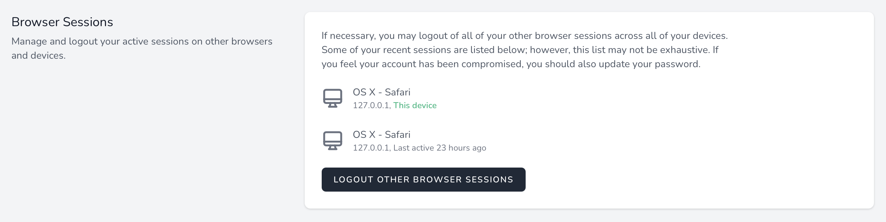

# Сеансы браузера

[[toc]]

## Введение

Пользователь получает доступ к функциям безопасности Laravel Jetstream с помощью раскрывающегося меню навигации профиля пользователя в правом верхнем углу. На этой панели инструментов Jetstream формирует представления, которые позволяют пользователю просматривать сеансы браузера, связанные с его учетной записью. Кроме того, пользователь может «выйти из сеанса» браузера, отличного от того, который используется устройством, которое он использует в данный момент.

Эта функция использует встроенный в Laravel мидлвар `Illuminate\Session\Middleware\AuthenticateSession` для безопасного выхода из других сеансов браузера, которые аутентифицированы как текущий пользователь.

## Действия

Большинство функций Jetstream можно настроить с помощью классов действий. Однако в целях безопасности службы сеансов браузера Jetstream инкапсулированы в Jetstream и не требуют настройки.

## Представления / Страницы

Как правило, соответствующие представления и страницы функции сеанса браузера не требуют настройки, поскольку они уже являются завершенными. Однако их расположение описано ниже на тот случай, если Вам потребуется внести небольшие изменения в презентацию этих страниц.

При использовании стека Livewire представление управления сеансом браузера отображается с использованием блейд-шаблона `resources/views/profile/logout-other-browser-sessions-form.blade.php`. При использовании стека Inertia это представление отображается с использованием шаблона `resources/js/Pages/Profile/LogoutOtherBrowserSessionsForm.vue`.
