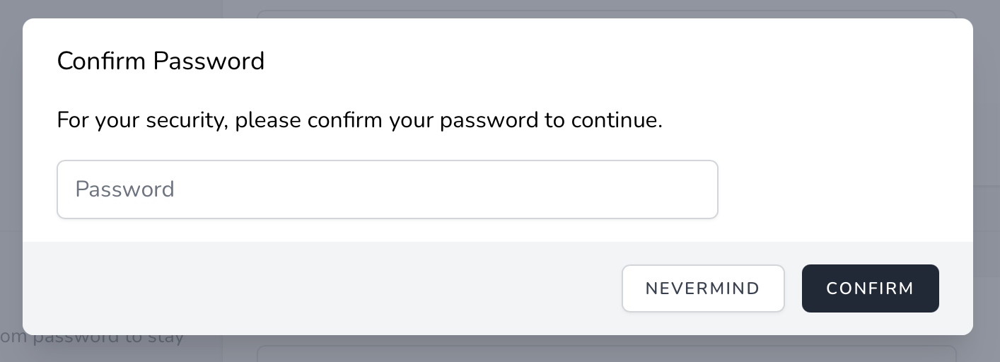

# Подтверждение пароля

[[toc]]

## Введение

При создании приложения Вы можете иногда выполнять действия, требующие от пользователя подтверждения пароля перед выполнением действия. Например, сама Jetstream требует, чтобы пользователи подтвердили свой пароль перед изменением настроек двухфакторной аутентификации. К счастью, в Jetstream есть встроенные функции, которые делают это удобным.

Jetstream предлагает два подхода к подтверждению пароля: подтверждение пароля на основе перенаправления и модальное подтверждение пароля.

#### Подтверждение пароля на основе перенаправления

Подтверждение пароля на основе перенаправления обычно используется, когда пользователю необходимо подтвердить свой пароль перед доступом ко всему экрану, отображаемому Вашим приложением, например экрану настроек биллинга.

Эта форма подтверждения пароля перенаправляет пользователя на специальный экран подтверждения пароля, где он должен подтвердить свой пароль перед перенаправлением в предполагаемое место назначения.

#### Подтверждение пароля на модальной основе

Модальная парольная аутентификация может использоваться, когда Вы хотите, чтобы пользователь подтвердил свой пароль перед выполнением определенного действия, например, при включении двухфакторной аутентификации.

Эта форма подтверждения пароля отображает модальное окно, которое позволяет пользователю подтвердить свой пароль перед выполнением предполагаемого запроса.

## Подтверждение пароля перенаправления

В следующей документации обсуждается, как использовать подтверждение пароля на основе перенаправления в Jetstream. Подтверждение пароля на основе перенаправления обычно используется, когда пользователю необходимо подтвердить свой пароль перед доступом ко всему экрану, отображаемому Вашим приложением, например экрану настроек биллинга.

Эта форма подтверждения пароля перенаправляет пользователя на специальный экран подтверждения пароля, где он должен подтвердить свой пароль перед перенаправлением в предполагаемое место назначения.


### Подтверждение пароля перенаправления через Livewire

#### Защита маршрутов

Чтобы реализовать подтверждение пароля через перенаправление на экран подтверждения пароля, Вы должны убедиться, что маршрут, который будет отображать представление, требующее подтверждения пароля, и любые маршруты, которые выполняют подтвержденные действия, назначены мидлвару `password.confirm`.

Этот мидлвар входит в стандартную установку Laravel и гарантирует, что пользователь будет перенаправлен на экран подтверждения пароля Вашего приложения, если они попытаются получить доступ к маршрутам без подтверждения своего пароля:

```php
Route::get('/billing', function () {
    // ...
})->middleware(['password.confirm']);

Route::post('/billing', function () {
    // ...
})->middleware(['password.confirm']);
```

Это представление, которое отображает экран подтверждения пароля стека Livewire, находится по адресу `resources/views/auth/confirm-password.blade.php`. Как правило, это представление не требует настройки; однако Вы можете вносить общие изменения в презентацию этой страницы на основе дизайна вашего собственного приложения.

#### Убедитесь, что пароль подтвержден

Затем компоненты Livewire, которые содержат действие, которое должно требовать подтверждения пароля перед вызовом, должны использовать трейт `Laravel\Jetstream\ConfirmsPasswords`.

После добавления этой характеристики в компонент Вы должны вызвать метод `ensurePasswordIsConfirmed` в любом действии Livewire, требующем подтверждения пароля. Делать это нужно в самом начале соответствующего метода действий:

```php
/**
 * Включить режим администрирования для пользователя.
 *
 * @return void
 */
public function enableAdminMode()
{
    $this->ensurePasswordIsConfirmed();

    // ...
}
```

:::warning Срок действия подтверждения пароля

После того, как пользователь подтвердит свой пароль, ему не потребуется повторно вводить пароль, пока не истечет количество секунд, определенное параметром конфигурации Вашего приложения `auth.password_timeout`:
:::

### Подтверждение пароля перенаправления через Inertia

Чтобы реализовать подтверждение пароля через перенаправление на экран подтверждения пароля, Вы должны убедиться, что маршрут, который будет отображать представление, требующее подтверждения пароля, и любые маршруты, которые выполняют подтвержденные действия, назначены мидлвару `password.confirm`.

Этот мидлвар входит в стандартную установку Laravel и гарантирует, что пользователь будет перенаправлен на экран подтверждения пароля Вашего приложения, если они попытаются получить доступ к маршрутам без подтверждения своего пароля:

```php
Route::get('/billing', function () {
    // ...
})->middleware(['password.confirm']);

Route::post('/billing', function () {
    // ...
})->middleware(['password.confirm']);
```

Эта страница, которая отображает экран подтверждения пароля стека Inertia, находится в `resources/js/Pages/Auth/ConfirmPassword.vue`. Как правило, эту страницу не нужно настраивать; однако Вы можете вносить общие изменения в презентацию этой страницы на основе дизайна Вашего собственного приложения.

:::warning Срок действия подтверждения пароля

После того, как пользователь подтвердит свой пароль, ему не потребуется повторно вводить пароль, пока не истечет количество секунд, определенное параметром конфигурации Вашего приложения `auth.password_timeout`:
:::

## Модальное подтверждение пароля

В следующей документации обсуждается, как использовать модальное подтверждение пароля в Jetstream. Модальная парольная аутентификация обычно используется, когда Вы хотите, чтобы пользователь подтвердил свой пароль перед выполнением определенного действия, например, при включении двухфакторной аутентификации.

Эта форма подтверждения пароля отображает модальное окно, которое позволяет пользователю подтвердить свой пароль перед выполнением предполагаемого запроса.



### Модальное подтверждение пароля через Livewire

#### Подготовка компонентов

Если Вы используете стек Livewire, компонент Livewire, содержащий действие, которое должно требовать подтверждения пароля перед вызовом, должен использовать трейт `Laravel\Jetstream\ConfirmsPasswords`.

#### Blade компоненты `confirms-password`

Затем в пользовательском интерфейсе Вашего приложения Вы должны заключить кнопку, которая запускает действие, в Blade-компонент `confirms-password`. Компонент оболочки `confirms-password` должен содержать директиву `wire:then`, которая указывает, какое действие Livewire должно выполняться после подтверждения пароля пользователя:

```html
<x-jet-confirms-password wire:then="enableAdminMode">
    <x-jet-button type="button" wire:loading.attr="disabled">
        {{ __('Enable') }}
    </x-jet-button>
</x-jet-confirms-password>
```

#### Обеспечение подтверждения пароля

После добавления компонента `confirms-password` в пользовательский интерфейс Вашего приложения Вы должны вызвать метод `ensurePasswordIsConfirmed` в действии Livewire, которое требует подтверждения пароля. Делать это нужно в самом начале соответствующего метода действий:

```php
/**
 * Включить режим администрирования для пользователя.
 *
 * @return void
 */
public function enableAdminMode()
{
    $this->ensurePasswordIsConfirmed();

    // ...
}
```

:::warning Срок действия подтверждения пароля

После того, как пользователь подтвердит свой пароль, ему не потребуется повторно вводить пароль, пока не истечет количество секунд, определенное параметром конфигурации Вашего приложения `auth.password_timeout`:
:::

### Модальное подтверждение пароля через Inertia

#### Vue компоненты `ConfirmsPassword`

Если Вы используете стек Inertia, Вам следует обернуть элемент пользовательского интерфейса, который запускает действие, требующее подтверждения пароля, с помощью компонента Vue `ConfirmsPassword`, предоставляемого Jetstream. Для начала импортируйте компонент `ConfirmsPassword` на свою страницу:

```js
import JetConfirmsPassword from './Jetstream/ConfirmsPassword'

export default {
    components: {
        JetConfirmsPassword,
        // ...
    },
}
```

Затем оберните компонент вокруг элемента пользовательского интерфейса, который запускает действие, которое необходимо подтвердить. Ваша страница должна прослушивать событие `@confirmed` компонента `ConfirmsPassword`, чтобы активировать метод, который должен вызываться после подтверждения пароля пользователя:

```html
<jet-confirms-password @confirmed="enableAdminMode">
    <jet-button type="button" :class="{ 'opacity-25': enabling }" :disabled="enabling">
        Включить
    </jet-button>
</jet-confirms-password>
```

#### Обеспечение подтверждения пароля

После добавления компонента `ConfirmsPassword` к вашему пользовательскому интерфейсу Вы должны убедиться, что маршруту, выполняющему подтвержденное действие, назначено мидлвару `password.confirm`. Этот мидлвар включен в стандартную установку Laravel:

```php
Route::post('/admin-mode', function () {
    // ...
})->middleware(['password.confirm']);
```

:::warning Срок действия подтверждения пароля

После того, как пользователь подтвердит свой пароль, ему не потребуется повторно вводить пароль, пока не истечет количество секунд, определенное параметром конфигурации Вашего приложения `auth.password_timeout`:
:::

## Настройка способа подтверждения паролей

Иногда Вам может потребоваться настроить способ проверки пароля пользователя во время подтверждения. Для этого Вы можете использовать метод `Fortify::confirmPasswordsUsing`. Этот метод принимает закрытие, которое получает экземпляр аутентифицированного пользователя и поле ввода запроса `password`. Замыкание должно вернуть `true`, если пароль действителен для данного пользователя. Обычно этот метод следует вызывать из метода `boot` Вашего `JetstreamServiceProvider`:

```php
use Illuminate\Support\Facades\Hash;
use Laravel\Fortify\Fortify;

/**
 * Загрузка любых служб приложений.
 *
 * @return void
 */
public function boot()
{
    // ...

    Fortify::confirmPasswordsUsing(function ($user, string $password) {
        return Hash::check($password, $user->password);
    });
}
```

Если Вы предпочитаете инкапсулировать процесс подтверждения пароля в классе, а не в замыкании, Вы можете передать "вызываемый" массив PHP методу  `confirmPasswordsUsing`:

```php
use App\Actions\ConfirmPassword;
use Laravel\Fortify\Fortify;

Fortify::confirmPasswordsUsing([new ConfirmPassword, '__invoke']);
```
