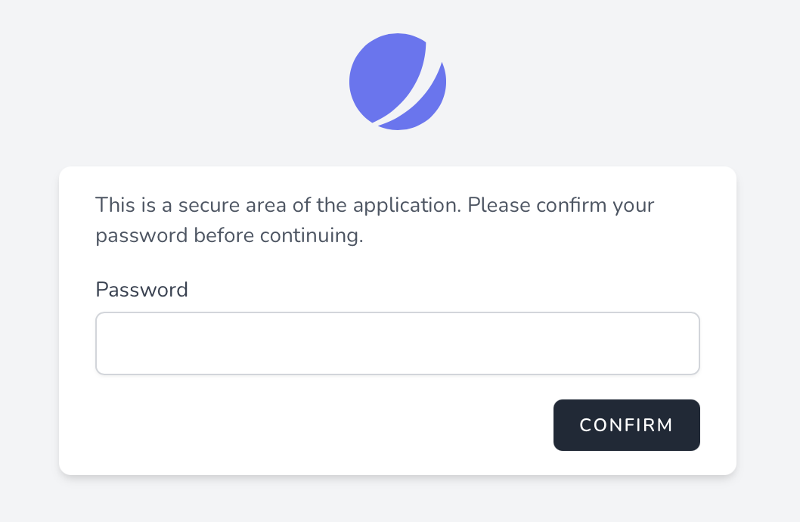

# Подтверждение пароля

[[toc]]

## Введение

При создании приложения Вы можете иногда выполнять действия, требующие от пользователя подтверждения пароля перед выполнением действия. Например, сама Jetstream требует, чтобы пользователи подтвердили свой пароль перед изменением настроек двухфакторной аутентификации. К счастью, в Jetstream есть встроенные функции, которые делают это удобным.

Jetstream предлагает два подхода к подтверждению пароля: подтверждение пароля на основе перенаправления и модальное подтверждение пароля.

#### Подтверждение пароля на основе перенаправления

Подтверждение пароля на основе перенаправления обычно используется, когда пользователю необходимо подтвердить свой пароль перед доступом ко всему экрану, отображаемому Вашим приложением, например экрану настроек биллинга.

Эта форма подтверждения пароля перенаправляет пользователя на специальный экран подтверждения пароля, где он должен подтвердить свой пароль перед перенаправлением в предполагаемое место назначения.

#### Подтверждение пароля на модальной основе

Модальная парольная аутентификация может использоваться, когда Вы хотите, чтобы пользователь подтвердил свой пароль перед выполнением определенного действия, например, при включении двухфакторной аутентификации.

Эта форма подтверждения пароля отображает модальное окно, которое позволяет пользователю подтвердить свой пароль перед выполнением предполагаемого запроса.

## Перенаправление подтверждение пароля

The following documentation will discuss how to use redirect based password confirmation in Jetstream. Redirect based password confirmation is typically used when the user needs to confirm their password before accessing an entire screen that is rendered by your application, such as a billing settings screen.

This form of password confirmation redirects the user to a dedicated password confirmation screen where they must confirm their password before being redirected to their intended destination.



### Redirect Password Confirmation Via Livewire

#### Protecting Routes

To implement password confirmation via redirect to a password confirmation screen, you should ensure that the route that will render the view that requires password confirmation and any routes that perform the confirmed actions are assigned the `password.confirm` middleware.

This middleware is included with the default installation of Laravel and will ensure that the user is redirected to your application's password confirmation screen if they attempt to access the routes without confirming their password:

```php
Route::get('/billing', function () {
    // ...
})->middleware(['password.confirm']);

Route::post('/billing', function () {
    // ...
})->middleware(['password.confirm']);
```

That view that renders the Livewire stack's password confirmation screen is located at `resources/views/auth/confirm-password.blade.php`. Generally, this view should not need customization; however, you are free to make general presentational tweaks to this page based on your own application's design.

#### Ensuring The Password Has Been Confirmed

Next, Livewire components that contain an action that should require password confirmation before being invoked should use the `Laravel\Jetstream\ConfirmsPasswords` trait.

After adding this trait to a component, you should call the `ensurePasswordIsConfirmed` method within any Livewire action that requires password confirmation. This should be done at the very beginning of the relevant action method:

```php
/**
 * Включить режим администрирования для пользователя.
 *
 * @return void
 */
public function enableAdminMode()
{
    $this->ensurePasswordIsConfirmed();

    // ...
}
```

:::warning Password Confirmation Expiration

Once the user has confirmed their password, they will not be required to re-enter their password until the number of seconds defined by your application's `auth.password_timeout` configuration option has elapsed:
:::

### Redirect Password Confirmation Via Inertia

To implement password confirmation via redirect to a password confirmation screen, you should ensure that the route that will render the view that requires password confirmation and any routes that perform the confirmed actions are assigned the `password.confirm` middleware.

This middleware is included with the default installation of Laravel and will ensure that the user is redirected to your application's password confirmation screen if they attempt to access the routes without confirming their password:

```php
Route::get('/billing', function () {
    // ...
})->middleware(['password.confirm']);

Route::post('/billing', function () {
    // ...
})->middleware(['password.confirm']);
```

That page that renders the Inertia's stack's password confirmation screen is located at `resources/js/Pages/Auth/ConfirmPassword.vue`. Generally, this page should not need customization; however, you are free to make general presentational tweaks to this page based on your own application's design.

:::warning Password Confirmation Expiration

Once the user has confirmed their password, they will not be required to re-enter their password until the number of seconds defined by your application's `auth.password_timeout` configuration option has elapsed:
:::

## Модальное подтверждение пароля

В следующей документации обсуждается, как использовать модальное подтверждение пароля в Jetstream. Модальная парольная аутентификация обычно используется, когда Вы хотите, чтобы пользователь подтвердил свой пароль перед выполнением определенного действия, например, при включении двухфакторной аутентификации.

Эта форма подтверждения пароля отображает модальное окно, которое позволяет пользователю подтвердить свой пароль перед выполнением предполагаемого запроса.


### Модальное подтверждение пароля через Livewire

#### Подготовка компонентов

Если Вы используете стек Livewire, компонент Livewire, содержащий действие, которое должно требовать подтверждения пароля перед вызовом, должен использовать трейт `Laravel\Jetstream\ConfirmsPasswords`.

#### Blade компоненты `confirms-password`

Next, in your application's user interface, you should wrap the button that triggers the action within the `confirms-password` Blade component. The `confirms-password` wrapper component should contain a `wire:then` directive that specifies which Livewire action should be run once the user's password has been confirmed:

```html
<x-jet-confirms-password wire:then="enableAdminMode">
    <x-jet-button type="button" wire:loading.attr="disabled">
        {{ __('Enable') }}
    </x-jet-button>
</x-jet-confirms-password>
```

#### Обеспечение подтверждения пароля

После добавления компонента `confirms-password` в пользовательский интерфейс Вашего приложения Вы должны вызвать метод `ensurePasswordIsConfirmed` в действии Livewire, которое требует подтверждения пароля. Делать это нужно в самом начале соответствующего метода действий:

```php
/**
 * Включить режим администрирования для пользователя.
 *
 * @return void
 */
public function enableAdminMode()
{
    $this->ensurePasswordIsConfirmed();

    // ...
}
```

:::warning Срок действия подтверждения пароля

После того, как пользователь подтвердит свой пароль, ему не потребуется повторно вводить пароль, пока не истечет количество секунд, определенное параметром конфигурации Вашего приложения `auth.password_timeout`:
:::

### Модальное подтверждение пароля через Inertia

#### Vue компоненты `ConfirmsPassword`

Если Вы используете стек Inertia, Вам следует обернуть элемент пользовательского интерфейса, который запускает действие, требующее подтверждения пароля, с помощью компонента Vue `ConfirmsPassword`, предоставляемого Jetstream. Для начала импортируйте компонент `ConfirmsPassword` на свою страницу:

```js
import JetConfirmsPassword from './Jetstream/ConfirmsPassword'

export default {
    components: {
        JetConfirmsPassword,
        // ...
    },
}
```

Затем оберните компонент вокруг элемента пользовательского интерфейса, который запускает действие, которое необходимо подтвердить. Ваша страница должна прослушивать событие `@confirmed` компонента `ConfirmsPassword`, чтобы активировать метод, который должен вызываться после подтверждения пароля пользователя:

```html
<jet-confirms-password @confirmed="enableAdminMode">
    <jet-button type="button" :class="{ 'opacity-25': enabling }" :disabled="enabling">
        Включить
    </jet-button>
</jet-confirms-password>
```

#### Обеспечение подтверждения пароля

После добавления компонента `ConfirmsPassword` к вашему пользовательскому интерфейсу вы должны убедиться, что маршруту, выполняющему подтвержденное действие, назначено мидлвару `password.confirm`. Этот мидлвар включен в стандартную установку Laravel:

```php
Route::post('/admin-mode', function () {
    // ...
})->middleware(['password.confirm']);
```

:::warning Срок действия подтверждения пароля

После того, как пользователь подтвердит свой пароль, ему не потребуется повторно вводить пароль, пока не истечет количество секунд, определенное параметром конфигурации Вашего приложения `auth.password_timeout`:
:::

## Настройка способа подтверждения паролей

Иногда Вам может потребоваться настроить способ проверки пароля пользователя во время подтверждения. Для этого Вы можете использовать метод `Fortify::confirmPasswordsUsing`. Этот метод принимает закрытие, которое получает экземпляр аутентифицированного пользователя и поле ввода запроса `password`. Замыкание должно вернуть `true`, если пароль действителен для данного пользователя. Обычно этот метод следует вызывать из метода `boot` Вашего `JetstreamServiceProvider`:

```php
use Illuminate\Support\Facades\Hash;
use Laravel\Fortify\Fortify;

/**
 * Загрузка любых служб приложений.
 *
 * @return void
 */
public function boot()
{
    // ...

    Fortify::confirmPasswordsUsing(function ($user, string $password) {
        return Hash::check($password, $user->password);
    });
}
```

Если Вы предпочитаете инкапсулировать процесс подтверждения пароля в классе, а не в замыкании, Вы можете передать "вызываемый" массив PHP методу  `confirmPasswordsUsing`:

```php
use App\Actions\ConfirmPassword;
use Laravel\Fortify\Fortify;

Fortify::confirmPasswordsUsing([new ConfirmPassword, '__invoke']);
```
